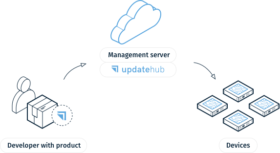

<p align="center"></p>

[](https://app.fossa.com/projects/git%2Bgithub.com%2FUpdateHub%2Fupdatehub?ref=badge_shield)
[](https://coveralls.io/github/Updatehub/updatehub?branch=master)

| Platform | Build Status |
| -------- | ------------ |
| Linux - x86_64 | [](https://github.com/Updatehub/updatehub/actions) |
| Linux - AArch64 | [](https://github.com/Updatehub/updatehub/actions) |
| Linux - ARMv7 | [](https://github.com/Updatehub/updatehub/actions) |

---

**UpdateHub** is an enterprise-grade solution which makes simple to remotely
update all your embedded devices in the field. It handles all aspects related to
sending Firmware Over-the-Air (FOTA) updates with maximum security and
efficiency, making your project the center of your attention.

<p align="center"></p>

This repository provides the **UpdateHub** agent for Embedded and Industrial
Linux-based devices.

## Getting started

To start using **UpdateHub**, it is suggested that you follow the [Getting
started](https://docs.updatehub.io/quick-starting-with-raspberrypi3/) guide in
the **UpdateHub** documentation.

## Features

The support provided by the **UpdateHub** for the device includes:

- Bootloader upgrade support (U-Boot and GRUB)
- Flash support (NAND, NOR)
- UBIFS support
- Update package signature validation for security
- Automated rollback in case of update fail
- Conditional installation (content, version and custom pattern support)
- Callback support for every update step
- HTTP API to control and inquiry the local agent

To learn more about UpdateHub, check out our [documentation](https://docs.updatehub.io).

## Building and testing

The **UpdateHub** agent is developed using Rust programing language due its
focus in safety and system level integration. In case you wish to build it, you
can:

```bash
cargo build --release
```

Some tests are marked as ignored because they require user previleges. There's a
Vagrant file that can be used to run them. To run tests on the virtual machine
run:

```bash
vagrant up
vagrant ssh
```

and inside the SSH session, run:

```bash
sudo -i
cd /vagrant
cargo test
cargo test -- --ignored
```

## License

Licensed under Apache License, Version 2.0 (LICENSE-APACHE or https://www.apache.org/licenses/LICENSE-2.0).

## Contributing

**UpdateHub** is an open source project and we love to receive contributions
from our community. If you would like to contribute, please read our
[contributing guide](CONTRIBUTING.md).

Unless you explicitly state otherwise, any contribution intentionally submitted
for inclusion in the work by you, as defined in the Apache-2.0 license, shall be
dual licensed as above, without any additional terms or conditions.

